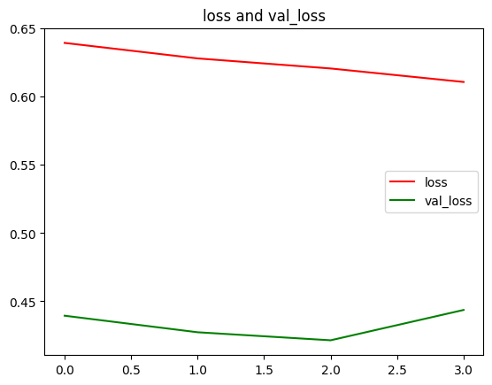

# Digits Recognition And Localization

Digit recognition and localization are essential tasks in various applications, such as optical character recognition (OCR), automated form processing, and digitized document analysis. This project utilizes deep learning techniques to detect and recognize digits in images.

## Tools

- [Tensorflow](https://www.tensorflow.org): Python Library for Deep Learning
- [EfficientNetV2L](https://www.tensorflow.org/api_docs/python/tf/keras/applications/efficientnet_v2/EfficientNetV2L): Pre-trained model architecture for efficient image recognition

## Results

### Model Loss


The model loss graph demonstrates the training progress over epochs. Lower loss values indicate better convergence and model performance.

### Sample Results


The image showcases sample predictions made by the model. Each prediction includes the localized bounding box and the predicted digit label. 

## Usage

To clone the code and replicate the results, follow these steps:

```bash
git clone <model-repo-url>
cd <project-directory>
# Setup your Python environment and dependencies
# Run the model inference on your dataset or test images
```
